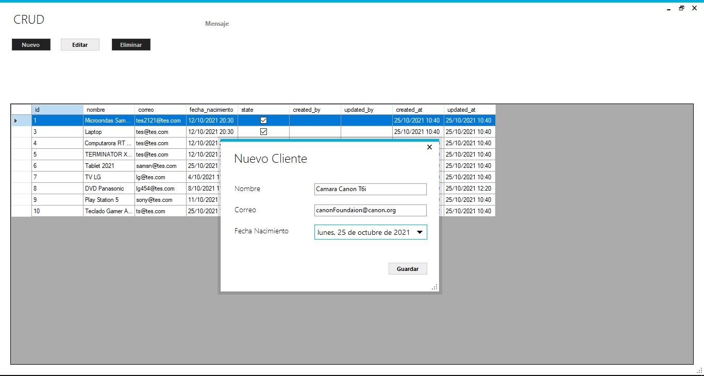

# pr-crud-windowform-sql-app1
25/10/2021
Crear CRUD en Windows Forms con C# .Net, Entity Framework y Sql Server, tomado el ejemplo de YT, funciona al 100%.

Se uso paquetes ingnorados: 
> EntityFramework.6.2.0
> MetroModernUI.1.4.0.0

ademas de ignoró capeta bin.

Muestra Real:
 

